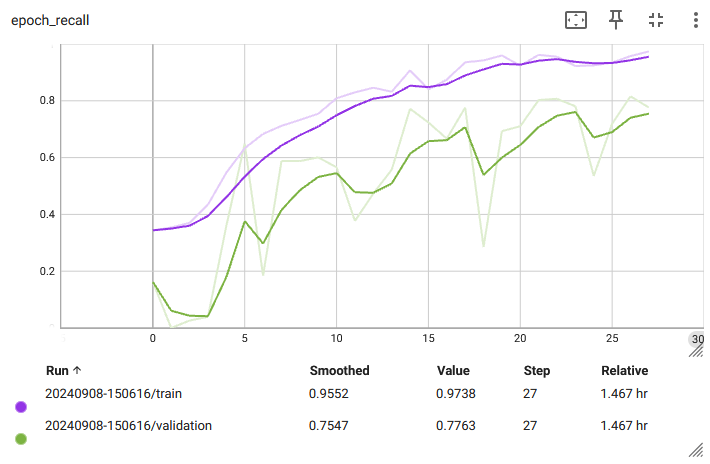

# NC_HW_phishing_classification
A project for training, evaluating and running inference on phishing classifier. 

## Setup
Aplication uses Python 3.11.9   
* Create python environment  
`python -m venv .venv`
* Activate environment  
`source .venv/bin/activate`
* Install dependencies  
`pip install -r requirements.txt`
* Download classification model and save it to `model/` directory.
* Inference:
    * Start API  
    `fastapi run main.py`
    * Open API at:  
    `http://0.0.0.0:8000/docs`
* Training:
    * Run jupyter lab  
    `jupyter lab`
    * Run [notebook](notebook/KerasEfficientnet.ipynb)

## Approach

### Data preprocessing
* Removal of duplicate images
* Image resizing to (256, 256, 3)
* Scaling of pixel values to [0, 1] range.

### Model
EfficientNetB0  
- Total params: 4,062,381 (15.50 MB)
- Trainable params: 4,020,358 (15.34 MB)
- Non-trainable params: 42,023 (164.16 KB)

Loss: CategoricalFocalCrossentropy

### Metrics
* auc   
* recall  
* recall_others - calculates recall only for the class 'others'  

### Possible improvements
* Collect more data for under-represented classes.
* Add image augmentation step to create more samples for under-represented classes. 
* Investigate if adds impact classification results, if so hide ads in preprocessing step.

## Inference speed
Classification of all dataset (3558 images) took: 139s [39 ms/image]  
Setup: 8GB RAM, CPU

## Understanding model's decision making
To better understand model predictions, I've looked at confusion matrix and applied grad-cam approach for convolutional layer visualization.

Confusion matrix shows that most miss-classification comes from predicting images as Facebok. This might be due to the disbalance in training dataset.  

To investigate why model predicts a certain class, we can look into the activations of the last convolutional layer. This might explain on which parts of the picture the model focuses and help us determine the reasoning for classification. Visualization can be found in the [notebook](notebook/classification_visualization.ipynb)